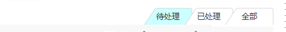
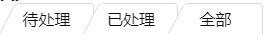

# CSS实现梯形tab样式

最近公司抠脚产品突然给了一个让我感兴趣的图，大概长这样：



我最开始想的是拿三角形和正方形的div来拼接然后定位堆叠，仔细想想应该可以实现，但是还是抱着试试看的态度google了一下，果然发现了更nice的方案，大致思想其实就是3d翻转视觉欺骗这种吧哈哈，这是我的抠脚理解，应该不怎么对，最后靠这个方法实现了，感觉挺有意思的，记录一下吧。

先上代码：

```html
//html代码
<ul class="tab">
  <li>待处理</li>
  <li>已处理</li>
  <li>全部</li>
</ul>
```

```css
//css代码 
.tab > li {
    width: 80px;
    padding: 4px 5px 3px 20px;
    text-align: center;
    display: inline-block;
    position: relative;
    color: #0C0C0C;
    z-index: 0;
    cursor: pointer;
  }

.tab > li:before {
    content: "";
    position: absolute;
    top: 0;
    left: 0;
    right: -15px;
    bottom: 0;
    z-index: -1;
    background: #fff;
    border: 1px solid #d8d8d8;
    border-radius: 5px 5px 0 0;
    border-bottom: none;
    transform: scaleY(1.2) perspective(.5em) rotateX(3deg);
    -webkit-transform: scaleY(1.2) perspective(.5em) rotateX(3deg);
    -moz-transform: scaleY(1.2) perspective(.5em) rotateX(3deg);
    -ms-transform: scaleY(1.2) perspective(.5em) rotateX(3deg);
    -o-transform: scaleY(1.2) perspective(.5em) rotateX(3deg);
    transform-origin: bottom right;
  }
.tab > li:hover:before {
    background-color: #e3e3e3;
  }
```

效果如下：



拼接的方法我有时间的话再来填坑哈>_<~