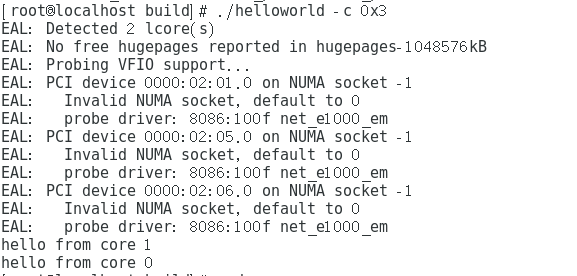

## DPDK分享	

### What？

**Data Plane Development Kit**，数据面开发工具，可以理解为一个进行数据包处理的SDK。

### Why?

1. **先看传统包处理流程：**
  + 数据包到达网卡设备；
  + 网卡设备依据配置进行DMA操作；
  + 网卡发送中断，唤醒处理器；
  + 驱动软件填充读写缓冲区数据结构；
  + 数据报文达到内核协议栈，进行高层处理；
  + 如果最终应用在用户态，数据从内核搬移到用户态；
  + 如果最终应用在内核态，在内核继续进行。

2. **传统包处理流程的问题：**
   在高速网络处理过程中，每个报文就会触发中断，中断带来的开销变得突出，大量数据到来会触发频繁的中断开销，导致系统无法承受。

3. **DPDK解决方案：**

   - 轮询

   - 用户态驱动（避免不必要的内存拷贝和系统调用，而且开发者有更强的主动性，可以不受限于内核现有的  数据格式和行为定义）

   - 亲和性与独占（利用线程的CPU亲和绑定的方式，特定任务可以被指定在某个核上工作，如果设置某CPU不参与系统调度，就可能使线程独占该核，CPU affinity 使用位掩码(bitmask)表示, 每一位都表示一个CPU, 置1表示"绑定"，最低位表示第一个逻辑CPU, 最高位表示最后一个逻辑CPU）

   - 降低访存开销（网络数据包处理是一种典型的I/O密集型工作负载，无论是CPU指令还是DMA，对于内存子系统都会访问频繁。当前一些已知的高效方法被应用在dpdk中，比如内存大页，内存非对称感知，NUMA架构下）


##  Let's Begin!

1.  **Linux虚拟机配置：**

  - 平台：CentOS 7
   - 处理器：2
   - 网卡：3
   - 内存：2G+
   - 硬盘：20G+

2. **安装：**

   - **https://dpdk.org/download下载安装包，我选择的是17.11.1 LTS**
   - **解压，进入对应目录：**

   ```shell
   tar xf dpdk-17.11.1.tar.xz
   cd dpdk-stable-17.11.1
   ```
   - **虚拟机需要打补丁：**

   ```c
       /* fall back to INTX */

     278         case RTE_INTR_MODE_LEGACY:

     279    -      /* if (pci_intx_mask_supported(udev->pdev)) {

     280    -                     dev_dbg(&udev->pdev->dev, "using INTX");

     281    -                     udev->info.irq_flags = IRQF_SHARED | IRQF_NO_THREAD;

     282    -                     udev->info.irq = udev->pdev->irq;

     283    -                     udev->mode = RTE_INTR_MODE_LEGACY;

     284    -                     break;

     285    -             }

     286    -             dev_notice(&udev->pdev->dev, "PCI INTX mask not supported\n");*/

     287    +  dev_dbg(&udev->pdev->dev, "using INTX");

     288    + 	udev->info.irq_flags = IRQF_SHARED;

     289    + 	udev->info.irq = udev->pdev->irq;

     290    +    udev->mode = RTE_INTR_MODE_LEGACY;

     291    +    break;

     292         /* fall back to no IRQ */

     293         case RTE_INTR_MODE_NONE:

     294                 udev->mode = RTE_INTR_MODE_NONE;

     295                 udev->info.irq = UIO_IRQ_NONE;

     296                 break;
   ```

   - **运行usertools/dpdk-setup.sh进行安装配置：**

   ```shell
   ./usertools/dpdk-setup.sh
   ```


1. 输入 14，编译项目；

2. 输入 17，引入用户态IO模块；

3. 输入 20，然后根据提示输入需要的大页的页数，一页大小为2M，此处可根据需要输入，如输入128，此时为dpdk分配128个2M的大页，相当于分配256M内存空间；（分配完后可输入 28 ，查看当前内存页使用情况）

   


4. 输入 23，绑定网卡至用户态IO模块，即用户态驱动模块；

   

​        此时，三个网卡都属于Active状态，无法绑定用户态驱动，必须先把要绑定的网卡停掉，比如此处要绑定0000::02:05.0和0000::02:06.0这两张网卡，就需要先运行：

```
ifconfig ens37 down
ifconfig ens38 down
```

​       之后，再输入23，查看情况如下：


​      可以看到要绑定的两张网卡已经不是活跃状态，此时输入02:05.0绑定该网卡，回车后再次输入23，按提示输入02:06.0，绑定另一张网卡，到这个时候，就绑定了两张网卡了，此时状态如下：


5. 输入 27 ，运行testpmd例子：

   

   输入处理器掩码，制定dpdk亲和的内核，此处两个内核，所以输入0x3，

   此时如果没有什么问题，就会弹出testpmd命令输入提示：

   ```shell
   testpmd>
   ```

   输入start 开始发包测试，输入stop 停止发包，会列出绑定的两个网卡上收发包的情况：

   

## Helloworld

运行如下命令编译自带例子于 /build/example文件夹：

```shell
make -C examples RTE_SDK=$(pwd) RTE_TARGET=build O=$(pwd)/build/examples
```

进入helloword编译之后的文件夹：

```shell
/home/yeenjian/dpdk-stable-17.11.1/build/examples/helloworld/build
```

运行helloword:

```shell
./helloworld -c 0x3
```

结果：



   helloworld代码：

```c
static int
lcore_hello(__attribute__((unused)) void *arg)
{
        unsigned lcore_id;
        lcore_id = rte_lcore_id();
        printf("hello from core %u\n", lcore_id);
        return 0;
}

int
main(int argc, char **argv)
{
        int ret;
        unsigned lcore_id;

        ret = rte_eal_init(argc, argv);
        if (ret < 0)
                rte_panic("Cannot init EAL\n");

        /* call lcore_hello() on every slave lcore ,遍历所有绑定从线程的核*/
        RTE_LCORE_FOREACH_SLAVE(lcore_id) {
                rte_eal_remote_launch(lcore_hello, NULL, lcore_id);
        }

        /* call it on master lcore too */
        lcore_hello(NULL);

        rte_eal_mp_wait_lcore();
        return 0;
}


```

