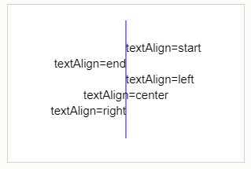
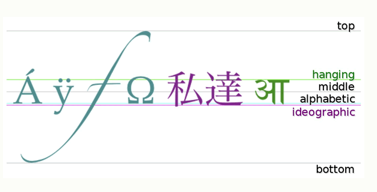

# canvas绘图textAlign&textBaseline

​        最近在看canvas，涉及到绘制文本的地方的时候出现了这两个配置，第一个还挺好理解的，涉及第二个我就有点懵了，所以查了点资料，记录一下备忘。

假设绘制文本的配置如下：

```javascript
context.font = 'bold 14px Arial';
context.textAlign  = 'start';
context.textBaseline = 'alghabetic'；
context.fillText('test text',50,100)；
```

假设绘制文本配置的坐标为(x, y)，即上述代码中的(50,100)

- **textAlingn：**表示轴线y=x和绘制文本的位置关系，默认值为start。可以有5个取值，为start、end、left、right、center，分别表示 ***轴线  相对于 文本***  的位置，比如left表示轴线位于文本的左侧；
  

- **textBaseline：**表示基线x=y位于文本的位置，默认值为alphabetic。可以有六个取值，为top、middle、bottom、alphabetic、hanging、ideographic，分别表示 ***基线 相对于 文本*** 的位置，前三个都是字面意思，后三个对于我这种知识匮乏的宝宝来说根本不理解呀第一次看的时候，但是我现在懂了，嘿嘿嘿。

  ​要弄懂这个首先得了解基线的相关知识，英语这种语言在排版上有很明确的基线，大概是为了排版美观不混乱吧，英语中基线的位置就是字母x的下边缘。涉及到其他语言的时候，基线的概念也就具备了语言特色，印度文中基线的位置为hanging，可以译为”悬挂“基线，中文中基线的位置为ideographic，可以译为”表意“基线。

  ​        当设置基线为后面三个可选值时，文字排版规则如下：

  - alphabetic：以x=y做文本的英文标准基线；

  - hanging：以x=y做文本的悬挂基线；

  - ideographic：以x=y做文本的表意基线；

​        在字符超出alphabetic且文本中没有下行字母时，ideographic基线与bottom重合。

这几种基线的w3c示例图如下：